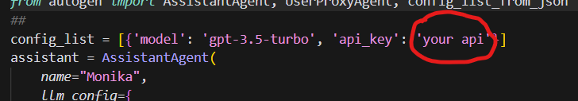

# MieruData
这是一个使用autogen的代理做数据分析的项目。
## 安装
1. 克隆该仓库
2. 进入项目目录
3. 安装依赖
   
bash
   pip install -r requirements.txt
   
4. 添加你的OpenAI API密钥
   在`AutogenAngent.py`中添加你的OpenAI API密钥:
   
python
   openai.api_key = "你的API密钥"
   
5. 添加代理(可选)
   如果需要,在`app.py`中添加你的代理URL:
   
## 使用
要使用该项目,运行:
python app.py
这将启动主应用程序。
AutogenAngent.py文件包含使用OpenAI API生成文本的示例。
## 贡献
欢迎对该项目做出贡献!请在GitHub上打开issue或pull request。
## 说明
该项目是作者的大作业Demo，作为学习项目无任何生产力,作者不会进行维护。
如果你需要我再次扩展或修改该README,请告知。我很乐意根据你的需求进行更新。